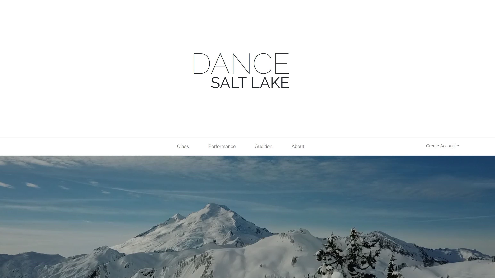
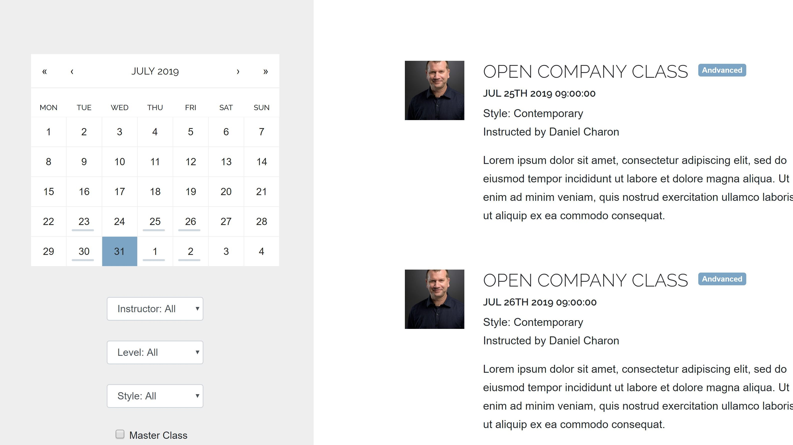
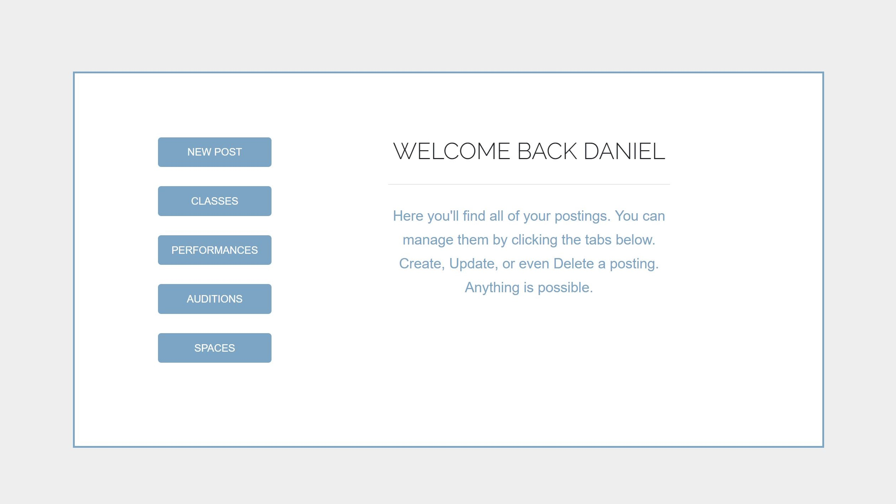

# Dance Salt Lake
A full stack web application, that is also mobile friendly which is geared towards Professional and Pre-Professional Dancers in the state of Utah.

## Using the App
Our app has two pathways for use. Anyone can visit the website and see information on classes, performances, auditions, and spaces for rent within the Salt Lake City are. In order for there to be data, individual artists, companies, and non-profit orgnaizations can register and submit all of their data.

### Posting a Class, Performance, Audition, or Space
Upon registering, Users are brought to the protected usershome page where they can create, update, or delete their events. Our copy feauture makes it extremely easy to create an event with multiple times or dates. The same is true for classes which are usually ongoing throughout the month.

### Already being Used
Our app has had extremely positive feedback from the Salt Lake City area and we are already in the works to move to a national network for dancers.

### Logging Out
At anytime, you can log out by simply pressing "Logout" in the dropdown on the navbar.

## Development Team
Daniel Mont-Eton
https://github.com/dansirdan

Jessica Bramwell
https://github.com/JessiBramwell

### Technologies Used
HTML
CSS
React
Express
Passport
Sessions
Formik
Yup
react-bootstrap-calendar
react-bootstrap
Bootstrap
Javascript
Node.js
jQuery
Geolocation API
Google Maps API
MySQL
JSON

## Photos

#### Home Page

#### Calendar Query

#### Users Home

